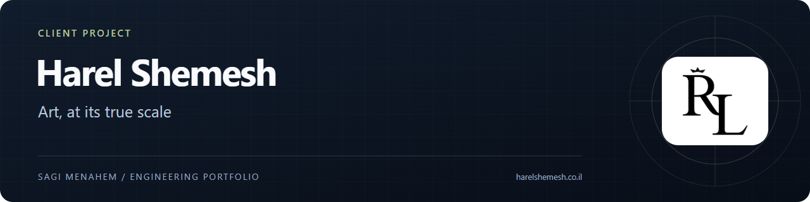
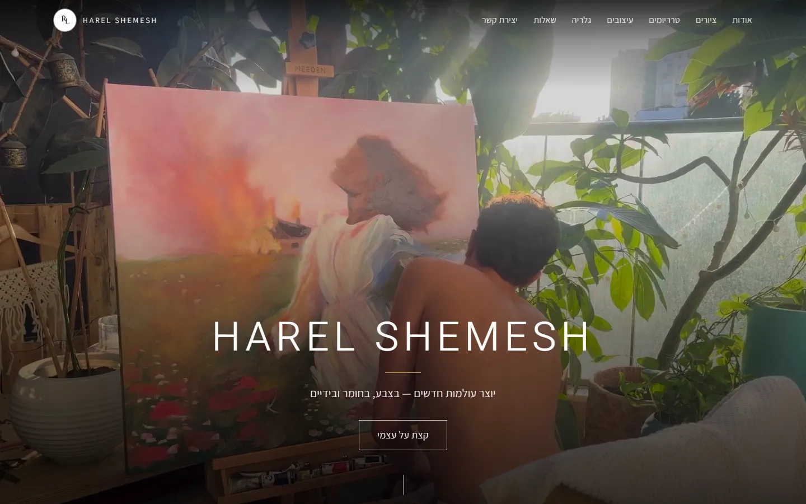
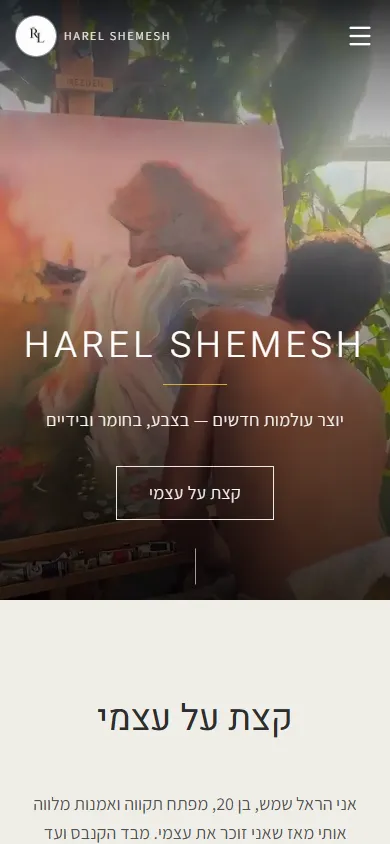
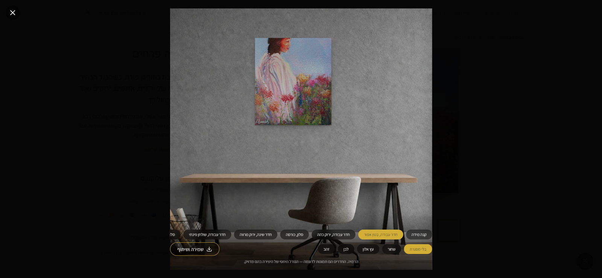

# Harel Shemesh

A portfolio and content platform for an artist working across paintings, terrariums, and upcycled pieces.

**Type:** Client platform · **My role:** Sole engineer, end to end · **Source:** Private; this repository is a public case study.

[Visit the live site](https://harelshemesh.co.il)

   

## Preview

  
  
   
  

## Problem and solution

An artist's site has to make work feel tangible while remaining simple for the artist to maintain. A thumbnail and a list of dimensions do not answer how a canvas will feel in a room. This platform combines an editorial gallery and client-managed CMS with a wall preview that renders artwork at a calibrated real-world scale, then provides a direct path to enquiry.

## Product highlights

- A gallery for paintings, terrariums, and upcycled work, with images and video in the same content system.
- A calibrated wall preview that places artwork by its centimetre dimensions, with selectable rooms and framing.
- Mobile-friendly image viewing, including zoom, pan, swipe navigation, and keyboard support.
- A custom admin workspace for site content, artworks, media, FAQs, and legal pages.
- Enquiries stored in an admin inbox and forwarded to the artist through WhatsApp.

## Engineering decisions

- **Use one geometry calculation for preview and export.** The DOM preview and PNG export share the placement logic, so the position and scale a visitor sees match the result they share.
- **Design around actual devices.** Hero-video loading was tested and corrected on a real iPhone after browser behaviour differed from the simulator; the final implementation retries playback only when the section becomes visible.
- **Keep the content workflow dependable.** Uploads go through a single validated path that derives image dimensions, creates stable object keys, and keeps media usable without manual technical work by the artist.

## Stack

Next.js App Router, React, TypeScript, Tailwind CSS, Supabase Postgres, Auth and Storage, Drizzle ORM, Radix UI, Serwist, Vercel, Sentry, and Vitest.

---

Content © Harel Shemesh · Code by [Sagi Menahem](https://sagimenahem.tech) · [AfterTech](https://www.after-tech.co.il/)
